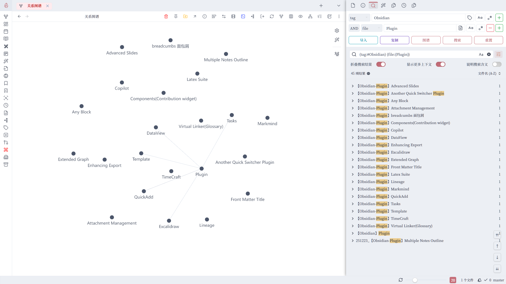

# Advanced Search UI Plugin for Obsidian

[中文说明](./README_zh.md)

This is a simple helper plugin for Obsidian's **native search**. It primarily provides a user-friendly **Graphical Interface (UI)** to help you build complex search queries without having to memorize syntax.

The plugin relies entirely on Obsidian's official search query syntax. For more details on what you can search, refer to the [Official Obsidian Search Documentation](https://help.obsidian.md/Plugins/Search).

> [!NOTE]
> **No configuration required!** Once installed and enabled, the UI will automatically appear at the top of your Search view. No hotkeys or settings are needed.

## Features

- **Visual Query Builder**: Build complex search strings without memorizing any syntax.
- **Boolean Support**: Easily combine filters with `AND`, `OR`, and `-` (NOT) logic.
- **Search Operators**: Supports all standard Obsidian search prefixes:
    - **All** (Full-text)
    - **File** (Filename)
    - **Tag** (Tag search)
    - **Path** (Directory/folder search)
    - **Content** (File content search)
    - **Line**, **Block**, **Section**
    - **Task**, **Task-todo**, **Tasks-done**
- **Smart Suggester**: Click on icons to quickly select from existing files, tags, or folders.
- **Case Sensitive & Regex**: Built-in toggles for matching case and using Regular Expressions.
- **Dynamic Rows**: Add (➕) or remove (➖) rows to create multi-step queries.
- **Quick Actions**:
    - **Search**: Execute the query directly in the search sidebar.
    - **Copy**: Copy the query as an Obsidian `query` code block.
    - **Graph**: Open the Graph View with current search filters applied.
    - **Import**: Reverse-engineer a query from the search box into the UI.
    - **Reset**: Clear all fields and start fresh.

## Installation

### Via BRAT (Recommended for Beta)

1. Install the **Obsidian BRAT** plugin from the community plugin store.
2. Open BRAT settings: **Settings** -> **BRAT**.
3. Click **Add Beta plugin**.
4. Paste the repository URL: `https://github.com/panda-no-night/obsidian-advanced-search-ui`.
5. Click **Add Plugin**.
6. Enable the plugin in **Community plugins**.

### Manual Installation
1. Download `main.js`, `manifest.json`, and `styles.css` from the [latest release](https://github.com/panda-no-night/obsidian-advanced-search-ui/releases).
2. Create a folder named `obsidian-advanced-search-ui` in your vault's `.obsidian/plugins/` directory.
3. Move the downloaded files into this folder.
4. Restart Obsidian and enable the plugin in settings.

## Usage

1. Open the **Search** leaf in your Obsidian sidebar.
2. You will see a new "Advanced Search" section at the top of the search view.
3. Configure your criteria using the drop-downs and input fields.
4. Click **Search** to run the query.

## Development

1. Clone this repository.
2. Run `npm install` to install dependencies.
3. Run `npm run build` or `npm run dev` to compile the project.

## Support

Developed by [PandaNocturne](https://github.com/PandaNocturne).

## License

[MIT](LICENSE)
