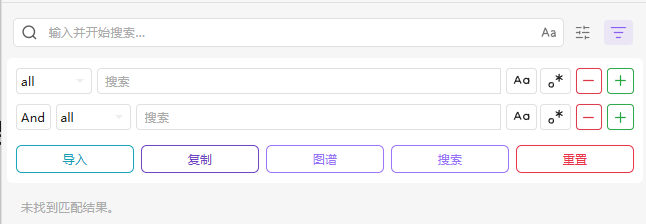
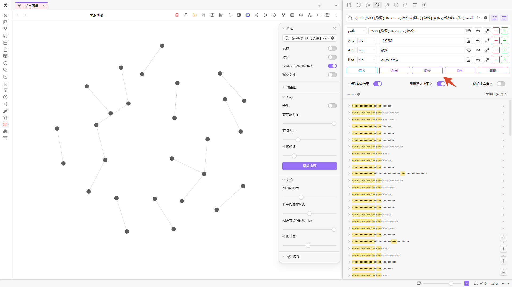
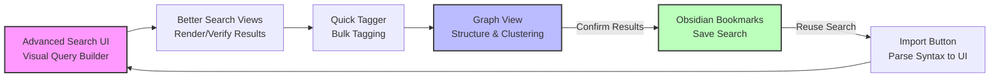

# Advanced Search UI Plugin for Obsidian

[中文说明](./README_zh.md)

This is a simple helper plugin for Obsidian's **native search**. It primarily provides a user-friendly **Graphical Interface (UI)** to help you build complex search queries without having to memorize syntax.

The plugin relies entirely on Obsidian's official search query syntax. For more details on what you can search, refer to the [Official Obsidian Search Documentation](https://help.obsidian.md/Plugins/Search).

> [!TIP]
> **No configuration required!** Once installed and enabled, the UI will automatically appear at the top of your Search view. No hotkeys or settings are needed.

## Key Features

- **Visual Query Builder**: Build complex search strings without memorizing any syntax through dropdowns and input fields.
- **Boolean Logic Support**: Easily combine filters with `AND`, `OR`, and `NOT` logic.
- **Rich Search Targets**:
  - `all` (Full-text)
  - `file` (Filename)
  - `tag` (Tag search)
  - `path` (Directory/folder search)
  - `content` (File content search)
  - `line` (Line search)
  - `block` (Block search)
  - `section` (Section search)
  - `task` (Task search)
  - `task-todo` (Task todo search)
  - `tasks-done` (Tasks done search)
- **Smart Suggester**: Click on icons to quickly select from existing files, tags, or folders.
- **Case Sensitive & Regex**: Built-in toggles for matching case and using Regular Expressions.
- **Dynamic Row Management**: Add (➕) or remove (➖) rows to create multi-step queries.
- **Quick Actions**:
    - **Search**: Execute the query directly in the search sidebar.
    - **Import**: Reverse-engineer a query from the search box into the UI.
    - **Copy**: Copy the query as an Obsidian `query` code block.
    - **Graph**: Open the Graph View with current search filters applied.
    - **Reset**: Clear all fields and start fresh.

## How to Use

1. Enable the Advanced Search UI plugin.
2. Open the **Search** view in your Obsidian sidebar. A filter button will appear to the right of the search input box.
3. Click the button to expand the Advanced Search UI.
4. Configure your criteria using the drop-downs and input fields. Click `➕` to add a search row, or `➖` to remove one, then click **Search**.

## Button Descriptions

- **Search**: Writes the constructed query expression into the native search box and executes it immediately.
- **Import**: Parses the text from the current search box back into the plugin interface for easy visual editing and fine-tuning.
  - Can be used with **Obsidian Bookmarks**: Execute a search and save it as a bookmark; later, when you open the search from the bookmark, click "Import" to load the expression back into the UI for further editing.
  - Tip: Useful for saving common searches as bookmarks and then importing them to the visual interface for quick modifications.
- **Copy**: Converts the current visual query into a `query` code block format and copies it to the clipboard, making it easy to paste into notes or templates for reuse.
- **Graph**: Opens the global Graph View and automatically applies the current search as a filter, showing only nodes and connections that match the search.
  - Ideal for combining with tag and path filters to quickly locate theme clusters and key documents.
    
- **Reset**: Clears all conditions in the current interface, restoring it to its initial state.

## Advanced Integration

Unlock more potential! The following community plugins can be used in conjunction with this plugin to create a complete "Search - View - Manage - Edit" loop.

- **[Better Search Views](obsidian://show-plugin?id=better-search-views)**:
  - Renders global search content, allowing search results to be presented in richer views. Combined with this plugin, it makes browsing complex query results more intuitive.
  - Suggested flow: Build query with this plugin → Execute in search view → Use Better Search Views to choose a suitable rendering view.
- **[Quick Tagger](obsidian://show-plugin?id=quick-tagger)**:
  - Allows bulk adding or removing tags from search results. When combined with graph filtering, it can quickly add or clean up tags for a specific theme cluster, making the graph structure clearer.
  - Suggested flow: Filter target set with this plugin → Use Quick Tagger in search results for bulk tagging → Return to graph view to see structural changes.

> [!TIP]
> **Closed-loop Workflow Suggestion**:
>
> 1. **Build & Optimize**: Build complex searches with this plugin → Preview results with Better Search Views → Refine tags with Quick Tagger.
> 2. **Observe & Solidify**: Observe the knowledge structure in the **Graph**, then save the search as a **Bookmark** once confirmed.
> 3. **Import & Iterate**: When adjustments are needed, use the **Import** button to restore complex syntax back to the visual interface for further modification, creating a complete "Search - View - Manage - Edit" loop.

## Installation

### Via BRAT (Recommended)

1. Install the **Obsidian BRAT** plugin from the community plugin store.
2. Go to **Settings** -> **BRAT**.
3. Click **Add Beta plugin**.
4. Paste the repository URL: `https://github.com/PandaNocturne/obsidian-advanced-search-ui`.
5. Click **Add Plugin**.
6. Enable the plugin in **Community plugins**.

### Manual Installation
1. Download `main.js`, `manifest.json`, and `styles.css` from the [latest release](https://github.com/PandaNocturne/obsidian-advanced-search-ui/releases).
2. Create a folder named `obsidian-advanced-search-ui` in your vault's `.obsidian/plugins/` directory.
3. Move the downloaded files into this folder.
4. Restart Obsidian and enable the plugin in settings.

## Development

If you want to build the plugin yourself:

1. Clone this repository.
2. Run `npm install` to install dependencies.
3. Run `npm run build` or `npm run dev` to compile the project.

## Credits

Developed by [PandaNocturne](https://github.com/PandaNocturne).

## License

[MIT](LICENSE)
