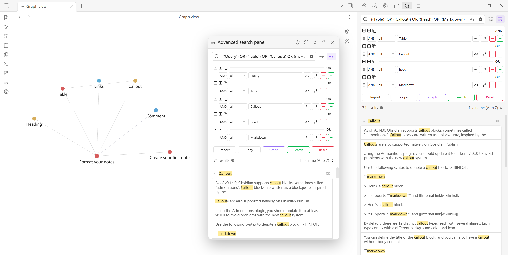
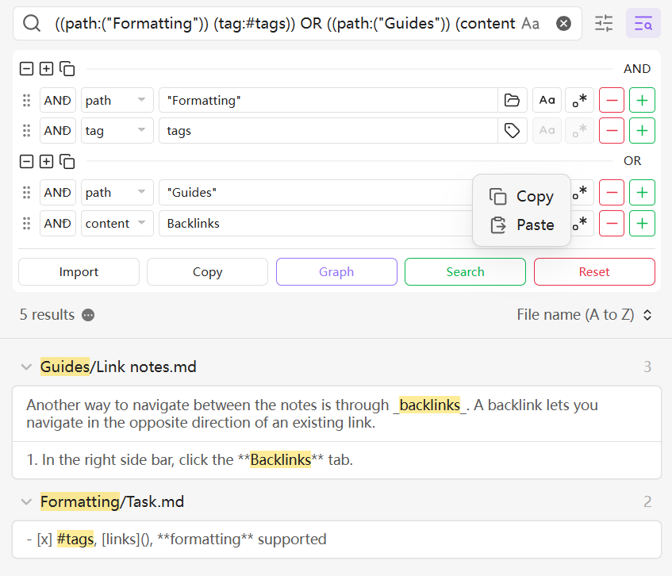
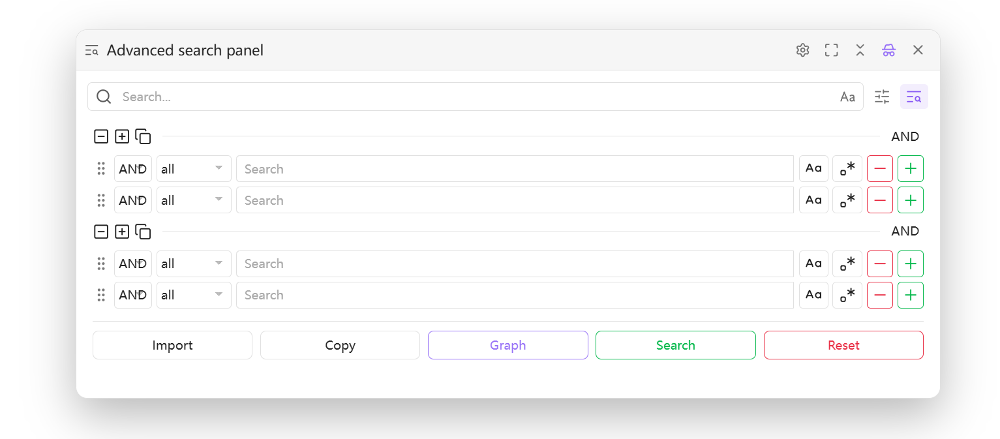
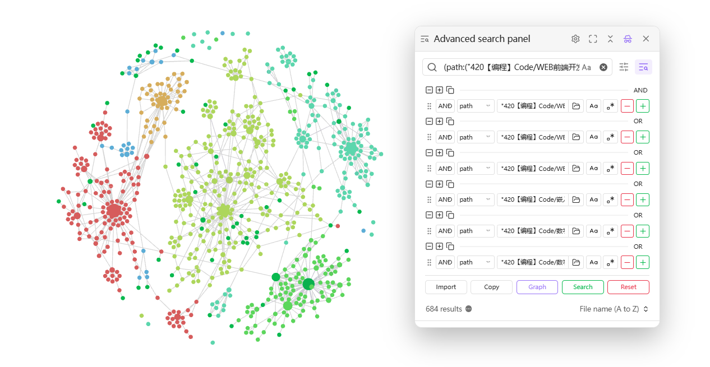

# Advanced Search UI Plugin for Obsidian

[中文说明](./README_zh.md)

This is a simple helper plugin designed for Obsidian's **native search**. It primarily provides an intuitive **Graphical Interface (UI)** that helps you build complex search queries without having to memorize syntax.

This plugin is implemented entirely on top of Obsidian's official query syntax. For details about the supported search syntax, refer to the [Official Obsidian Search Documentation](https://help.obsidian.md/Plugins/Search).

## Key features

- **Visual query builder**: Build queries easily through dropdowns and input fields without memorizing complex search syntax.
- **Boolean logic support**: Supports `AND`, `OR`, and `NOT` logical operators.
- **Rich search targets**: Supports `all` (full text), `file` (filename), `tag` (tag), `path` (path), `content` (content), `line` (line), `block` (block), `section` (section), `task` (task), `task-todo` (incomplete task), and `tasks-done` (completed task).
- **Quick picker**: Click icons to quickly choose from existing files, tags, or folder paths without typing manually.
- **Regex and case-sensitive search**: Built-in support for regular expressions and case-sensitive matching.
- **Dynamic row management**: Click `➕` to add a condition and `➖` to remove one.
- **Grouped query building**: Organize multiple conditions into groups so you can build more complex nested logical expressions.
- **Group panel operations**: Groups support collapsing, drag-and-drop reordering, and cross-panel dragging for faster query restructuring.
- **Group context actions**: Right-click a single group to copy and paste that group's query structure for reuse.
- **Floating search panel**: Use the advanced search panel as a standalone floating panel for faster access in different workspace layouts.
- **Enhanced graph integration**: Send search conditions into Graph view and import color group configurations to inspect filtered results by color grouping.

## How to use

1. Enable the Advanced Search UI plugin.
2. Open the **Search** view in the left sidebar of Obsidian. A filter button will appear to the right of the input box.
3. Click it to expand the advanced search UI. You will see an advanced search interface appear below the search box.
4. To open the **floating search panel**, use the **side button** or run the command `Advanced Search UI: Open floating search panel`.
5. Configure your search conditions, click `➕` to add one, click `➖` to remove one, then click **Search**.

## Advanced search panel

### Grouped queries and group panels

The group panel is suitable for multi-layer boolean logic scenarios. You can place several conditions into a group, then continue combining them with `AND`, `OR`, and `NOT` to build clearer complex queries.

- Collapse groups to hide parts you do not need to focus on in a complex search.
- Drag and drop groups to reorder them.
- Drag groups across panels to restructure queries more efficiently between different areas.
- Right-click a group to copy and paste that individual group's query structure for partial reuse.

### Advanced search panel and floating mode

The advanced search panel can also be used in floating mode, which suits workflows where you want to search while viewing other content. The floating panel supports free repositioning, collapsing and expanding, fullscreen display, and it remembers the last active position and size when closed so you can quickly resume your previous workspace state.

- Open the floating search panel from the **side button**.
- You can also open it with the command **Advanced Search UI: Open floating search panel**, then use advanced search features directly inside the floating panel.
- When the floating panel is open, it takes over Obsidian's default search entry points, such as the global search shortcut, bookmark-based search syntax import, and tag search. When it is closed, the default behavior is restored.

### Graph search and color group import

Graph search now supports importing color group configurations, so you can filter the graph and inspect node distribution and relationships for different color groups.

- Open Graph view with the current search conditions in one step.
- Import **color groups** so graph filtering works better with your existing grouping rules.
- Useful for topic clustering, information review, and layered observation of results.

## Button descriptions

- **Search**: Writes the query expression built in the UI into the native search box and executes it immediately. Results are shown in the Search view.
- **Import**: Parses the current search box text back into the plugin UI so you can edit and fine-tune it visually.
    - Can be used with **Obsidian Bookmarks**: first run a search and save it as a bookmark; later, when you open that bookmarked search, click **Import** to load the expression back into the UI for continued editing and reuse.
    - Tip: This is useful for saving common searches as bookmarks, then importing them into the visual interface for quick modification when needed.
- **Copy**: Converts the current visual query into a `query` code block and copies it to the clipboard, making it easy to reuse in notes or templates.
- **Graph**: Opens the global Graph view and automatically applies the current search as a filter so that only matching nodes and links are shown, making it easier to inspect result relationships from a broader perspective.
- **Reset**: Clears all current conditions and restores the interface to its initial state.

## Advanced integrations

To extend the search workflow further, the following community plugins work well alongside this plugin.

- **[Better Search Views](obsidian://show-plugin?id=better-search-views)**:
    - Renders global search content in richer views, making complex query results easier to browse together with this plugin.
    - Suggested flow: build a query with this plugin → run it in Search view → use Better Search Views to choose an appropriate rendering mode.
- **[Quick Tagger](obsidian://show-plugin?id=quick-tagger)**:
    - Lets you add or remove tags in bulk from search results. Combined with graph filtering, it helps add or clean up tags for a topic cluster so the graph structure becomes clearer.
    - Suggested flow: filter the target set with this plugin → use Quick Tagger on the search results for bulk tagging → return to Graph view to inspect the structural changes.

## Installation

### Install via BRAT (recommended)

1. Install the **Obsidian BRAT** plugin from the community plugin marketplace.
2. Go to **Settings** → **BRAT**.
3. Click **Add Beta plugin**.
4. Enter this repository URL: `https://github.com/PandaNocturne/obsidian-advanced-search-ui`.
5. Click **Add Plugin**.
6. Enable the plugin under **Community plugins**.

### Manual installation

1. Download the latest `main.js`, `manifest.json`, and `styles.css` from the [Releases](https://github.com/PandaNocturne/obsidian-advanced-search-ui/releases) page.
2. Create a folder named `obsidian-advanced-search-ui` under your vault's `.obsidian/plugins/` directory.
3. Put the downloaded files into that folder.
4. Restart Obsidian and enable the plugin in settings.

## Development

If you want to build the plugin yourself:

1. Clone this repository.
2. Run `npm install` to install dependencies.
3. Run `npm run build` to compile the project.

## Credits

Developed by [PandaNocturne](https://github.com/PandaNocturne).

## License

[MIT](LICENSE)