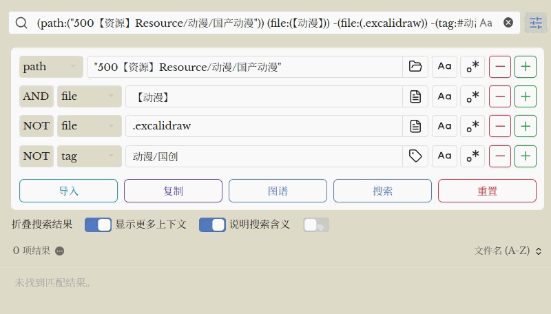

# Advanced Search UI Plugin for Obsidian

这是一个为 Obsidian **原生搜索** 设计的简单辅助插件。它主要提供了一个直观的 **图形界面 (UI)**，帮助您轻松构建复杂的搜索查询，而无需去死记硬背各种语法。

本插件完全基于 Obsidian 的官方查询语法实现。关于搜索语法的详细说明，请参阅 [Obsidian 官方搜索文档](https://help.obsidian.md/Plugins/Search)。

> [!TIP]
> **安装即用，无需配置！** 启用插件后，高级搜索界面会自动出现在搜索面板顶部，无需设置快捷键或进行额外配置。

> [!NOTE]
> 为了保持界面整洁，插件默认在 Obsidian 搜索工具（如：排序、折叠等按钮）下方呈折叠状态。点击标题即可展开。

> [!TIP]
> **默认折叠！** 为了保持搜索界面的整洁，插件默认在搜索工具下方呈折叠状态。只需点击“高级搜索”标题即可展开使用。

## 主要功能

- **可视化搜索构建器**：无需记忆复杂的搜索语法，通过下拉菜单和输入框轻松构建查询。
- **布尔逻辑支持**：支持 `AND`（与）、`OR`（或）、`NOT`（非）逻辑操作符。
- **丰富的搜索目标**：
    - `all` (全文)
    - `file` (文件名)
    - `tag` (标签)
    - `path` (路径)
    - `content` (内容)
    - `line` (行)
    - `block` (块)
    - `section` (章节)
    - `task` (任务)
    - `task-todo` (未完成任务)
    - `tasks-done` (已完成任务)
- **快捷选择器**：点击图标可快速从现有文件、标签或文件夹路径中选择，无需手动输入。
- **正则表达式与大小写匹配**：内置对正则表达式和区分大小写搜索的支持。
- **动态行管理**：点击 `➕` 增加搜索条件，点击 `➖` 删除搜索条件。
- **一键操作**：
    - **搜索**：直接在 Obsidian 搜索栏中执行构建的查询。
    - **复制**：将查询语句复制为 `query` 代码块格式。
    - **图谱**：打开关系图谱并自动应用当前搜索过滤。
    - **导入**：将当前搜索框中的文本导入到插件界面中进行反向编辑。
    - **重置**：快速清空所有搜索条件。

## 安装方法

### 通过 BRAT 安装 (推荐)

1. 在 Obsidian 社区插件市场安装 **BRAT** 插件。
2. 前往 **设置** -> **BRAT**。
3. 点击 **Add Beta plugin** (添加测试插件)。
4. 输入本仓库地址：`https://github.com/PandaNocturne/obsidian-advanced-search-ui`。
5. 点击 **Add Plugin**。
6. 在 **社区插件** 中启用该插件。

### 手动安装
1. 在 [Releases](https://github.com/PandaNocturne/obsidian-advanced-search-ui/releases) 页面下载最新的 `main.js`, `manifest.json`, `styles.css`。
2. 在你的库的 `.obsidian/plugins/` 目录下创建一个名为 `obsidian-advanced-search-ui` 的文件夹。
3. 将下载的文件放入该文件夹。
4. 重启 Obsidian 并在设置中启用。

## 如何使用

1. 打开 Obsidian 左侧面板的 **搜索** 视图。
2. 你会看到搜索框上方出现了一个新的高级搜索界面。
3. 配置你的搜索条件，然后点击 **搜索** 按钮。

## 开发

如果你想自行构建插件：

1. 克隆此仓库。
2. 运行 `npm install` 安装依赖。
3. 运行 `npm run build` 进行编译。

## 鸣谢

由 [PandaNocturne](https://github.com/PandaNocturne) 开发。

## 许可

[MIT](LICENSE)
