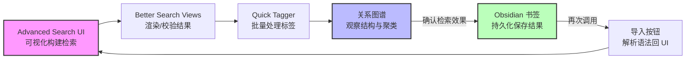

# Advanced Search UI Plugin for Obsidian

这是一个为 Obsidian **原生搜索** 设计的简单辅助插件。它主要提供了一个直观的 **图形界面 (UI)**，帮助您轻松构建复杂的搜索查询，而无需去死记硬背各种语法。

本插件完全基于 Obsidian 的官方查询语法实现。关于搜索语法的详细说明，请参阅 [Obsidian 官方搜索文档](https://help.obsidian.md/Plugins/Search)。

> \[!TIP]
> **安装即用，无需配置！** 启用插件后，高级搜索界面会自动出现在搜索面板顶部，无需设置快捷键或进行额外配置。

## 主要功能

- **可视化搜索构建器**：无需记忆复杂的搜索语法，通过下拉菜单和输入框轻松构建查询。
- **布尔逻辑支持**：支持 `AND`（与）、`OR`（或）、`NOT`（非）逻辑操作符。
- **丰富的搜索目标**：
  - `all` (全文)
  - `file` (文件名)
  - `tag` (标签)
  - `path` (路径)
  - `content` (内容)
  - `line` (行)
  - `block` (块)
  - `section` (章节)
  - `task` (任务)
  - `task-todo` (未完成任务)
  - `tasks-done` (已完成任务)
- **快捷选择器**：点击图标可快速从现有文件、标签或文件夹路径中选择，无需手动输入。
- **正则表达式与大小写匹配**：内置对正则表达式和区分大小写搜索的支持。
- **动态行管理**：点击 `➕` 增加搜索条件，点击 `➖` 删除搜索条件。
- **一键操作**：
  - **搜索**：直接在 Obsidian 搜索栏中执行构建的查询。
  - **复制**：将查询语句复制为 `query` 代码块格式。
  - **图谱**：打开关系图谱并自动应用当前搜索过滤。
  - **导入**：将当前搜索框中的文本导入到插件界面中进行反向编辑。
  - **重置**：快速清空所有搜索条件。

## 如何使用

1. 启动 Advanced Search UI 插件
2. 打开 Obsidian 左侧面板的 **搜索** 视图，输入框右侧会出现筛选按钮
3. 点击即可展开高级检索 UI 界面，你会看到搜索框下方出现了一个高级搜索界面。
4. 配置你的搜索条件，点击 `➕` 增加搜索条件，点击 `➖` 删除搜索条件，然后点击 **搜索** 按钮。

## 按钮说明

- **搜索**：将界面中构建的查询表达式写入原生搜索框并立即执行，结果显示在搜索视图中。
- **导入**：从当前搜索框文本反向解析到插件界面，便于可视化编辑与微调。
  - 可配合 **Obsidian 书签** 使用：先在搜索视图中执行检索并通过书签保存该检索；以后从书签打开检索后，点击本插件的“导入”即可把当前搜索框中的表达式载入到界面中继续编辑与复用。
  - Tip：适用于把常用检索保存为书签，再按需导入到可视化界面快速改写。
- **复制**：将当前可视化查询转换为 `query` 代码块格式并复制到剪贴板，方便粘贴到笔记或模板中复用。
- **图谱**：一键打开全局关系图谱，并自动套用当前检索作为筛选条件，仅显示与检索匹配的节点和连接，便于从宏观视角审视结果的关联结构。
  - 适合配合标签与路径过滤，快速定位主题簇与关键文档。
    
- **重置**：清空当前界面中的所有条件，恢复到初始状态。

## 进阶集成

进一步释放检索潜力！下面几款社区插件可与本插件配合，让“搜 - 看 - 管 - 改”形成完整闭环。

- **[Better Search Views](obsidian://show-plugin?id=better-search-views)**：
  - 可以渲染全局检索的内容，让搜索结果以更丰富的视图呈现，配合本插件更直观地浏览复杂查询的匹配结果。
  - 建议流程：用本插件构建查询 → 在搜索视图中执行 → 使用 Better Search Views 选择合适的渲染视图。
- **[Quick Tagger](obsidian://show-plugin?id=quick-tagger)**：
  - 可以从检索结果中批量添加或删除标签；与图谱筛选结合时，能快速为某一主题簇补充或清理标签，从而让图谱的结构更清晰。
  - 建议流程：用本插件筛出目标集合 → 在搜索结果中用 Quick Tagger 批量标注 → 回到图谱查看结构变化。

> \[!TIP]
> **闭环工作流建议**：
>
> 1. **构建与优化**：用本插件构建复杂检索 → 用 Better Search Views 直观预览结果 → 用 Quick Tagger 批量完善标签。
> 2. **观察与固化**：在 **图谱** 中观察知识结构，确认无误后将本次检索保存为 **书签**。
> 3. **导入与再迭代**：需要调整时，通过插件的 **导入** 按钮将书签中的复杂语法还原回可视化界面进行二次修改，形成“搜 - 看 - 管 - 改”的完整闭环。

## 安装方法

### 通过 BRAT 安装 (推荐)

1. 在 Obsidian 社区插件市场安装 **BRAT** 插件。
2. 前往 **设置** -> **BRAT**。
3. 点击 **Add Beta plugin** (添加测试插件)。
4. 输入本仓库地址：`https://github.com/PandaNocturne/obsidian-advanced-search-ui`。
5. 点击 **Add Plugin**。
6. 在 **社区插件** 中启用该插件。

### 手动安装

1. 在 [Releases](https://github.com/PandaNocturne/obsidian-advanced-search-ui/releases) 页面下载最新的 `main.js`, `manifest.json`, `styles.css`。
2. 在你的库的 `.obsidian/plugins/` 目录下创建一个名为 `obsidian-advanced-search-ui` 的文件夹。
3. 将下载的文件放入该文件夹。
4. 重启 Obsidian 并在设置中启用。

## 开发

如果你想自行构建插件：

1. 克隆此仓库。
2. 运行 `npm install` 安装依赖。
3. 运行 `npm run build` 进行编译。

## 鸣谢

由 [PandaNocturne](https://github.com/PandaNocturne) 开发。

## 许可

[MIT](LICENSE)
